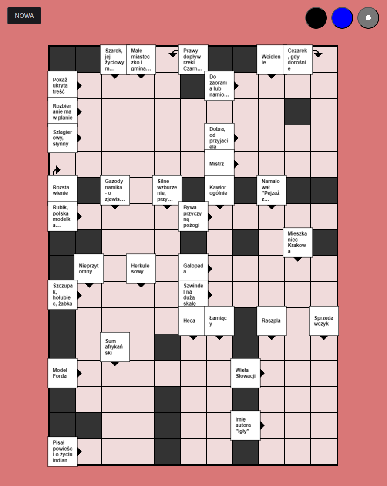

Crosswords is a crossword puzzle generation application specifically designed for tablet (tested on ipad pro 11') devices with stylus support. It features PWA.

Before using, please note that it is not possible to include a complete database of words and definitions due to copyright restrictions. Just populate the "public/cross.db3" (SQLlite) file with your own collection of words and corresponding clues. There are quite a few databases online.

It's a hobby project, developed within a week time. I don't program in JS/TS, so there is quite a mess in the code. The language in the program is Polish, as the whole thing was supposed to be a gift for an elderly person who doesn't speak English. Just a few words in the whole application to change.

### Install
npm install

### Debug
npm run start-remote

### Build
npm run build

### Usage
Tap definition to enlarge it.
Tap several times on answer field to reveal char.

[.](https://www.mediafire.com/file/6zf9v3bqypu4cfz/cross.db3/file)